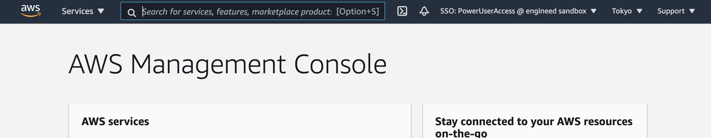
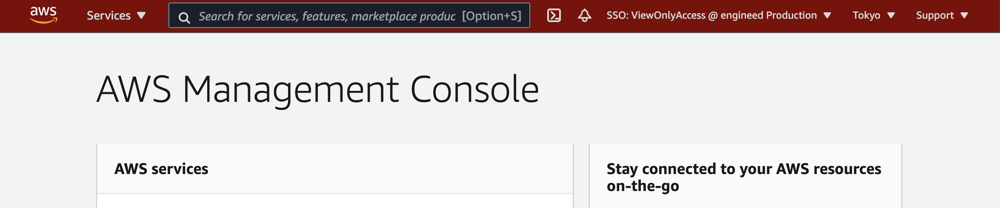

# Firefox Extension for AWS SSO

[日本語の説明はこちら](./README_ja.md)

This extension is for AWS Single Sign-On (AWS SSO). As for now, You can see what am I using Account Name and Permission Set for current console at AWS console's header. And then, AWS console header's color will be almost red if account name has 'Production' .

## How to use

You just add this extension from [Firefox ADD-ONS page](https://addons.mozilla.org/firefox/addon/extension-for-aws-sso/) to use this.
You can also contribute to add your functions to this.
