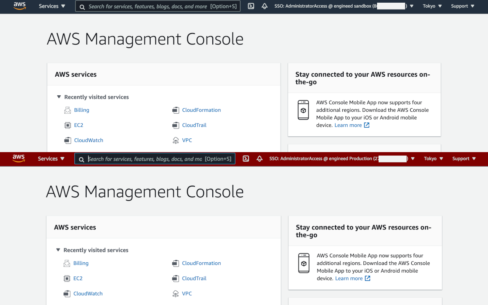

# Google Chrome Extension for AWS SSO

[日本語の説明はこちら](https://github.com/yaggytter/chrome-extension-awssso/blob/main/README_ja.md)

[Firefox Add-on is here](https://github.com/yaggytter/chrome-extension-awssso/tree/forfirefox)

This extension is for AWS Single Sign-On (AWS SSO). As for now, You can see what am I using Account Name and Permission Set for current console at AWS console's header. And then, AWS console header's color will be almost red if account name has 'Production' .

## How to use

You just add this extension from [chrome web store](https://chrome.google.com/webstore/detail/extension-for-aws-sso/ejjegcnihofdahmbbhekhkcnpflljeej) to use this.
You can also contribute to add your functions to this.
