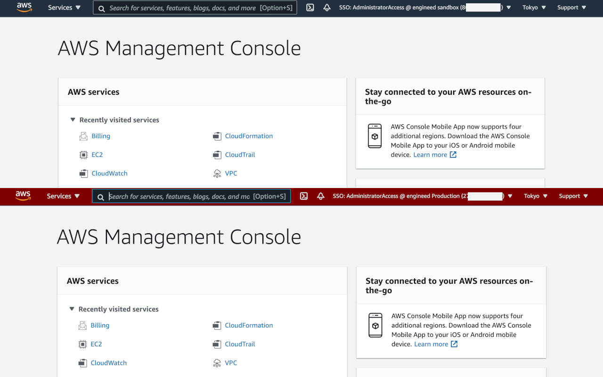

# Firefox 拡張機能 for AWS SSO

AWS Single Sign-On (AWS SSO) を使うときに、もうちょっと便利に使えるようにするための拡張機能です。
現状は、AWS コンソールのヘッダに、現在ログインしているアカウントとアクセス権限セットを表示する機能と、アカウント名に'Production'という文字列が含まれていた場合にヘッダを赤っぽくする機能、だけが実装されています。

## 使い方

[Firefox (ja) 向けアドオン](https://addons.mozilla.org/ja/firefox/addon/extension-for-aws-sso/) から、この拡張機能を検索して、 Firefox に追加するだけです。
